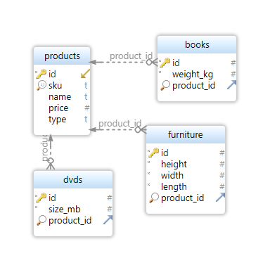

# Products API

This is the API provides an interface to manage products. The API is built using PHP and allows you to create, read, and delete products.

## Table of Contents

- [Installation](#installation)
- [Database Schema](#database-schema)
- [API Endpoints](#api-endpoints)

## Installation

1. Clone the repository to your local machine:
   `git clone https://github.com/makawy7/products-php-react.git`
2. Navigate to the project directory:
   `cd products-php-react/backend`
3. Install the dependencies using Composer:
   `composer install`
4. Copy the .env.example file as .env and add the database details:
   `cp .env.example .env`

```ini
DB_HOST=localhost
DB_NAME=scanditask
DB_USER=root
DB_PASSWORD=
```

5. Import the scanditask.sql file into your MySQL database to set up the required tables.
6. Run the server.
   `php -S localhost:1000`

## Database Schema



## API Endpoints

### Get all products

- Method: `GET`
- URL: `/api/products`

### Create a new product

- Method: `POST`
- URL: `/api/product/create`
- Payload:
  - `type`: Type of product, must be one of "dvd", "furniture", or "book".
  - `sku`: string
  - `name`: string
  - `price`: number
  - `weight_kg`: number (required only when `type` is "book")
  - `size_mb`: number (required only when `type` is "dvd")
  - `height`: number (required only when `type` is "furniture")
  - `width`: number (required only when `type` is "furniture")
  - `length`: number (required only when `type` is "furniture")
- Example payload:

```json
{
  "type": "book",
  "sku": "FLBD789",
  "name": "Tout le bleu de ciel",
  "price": 19.99,
  "weight_kg": 0.9
}
```

### Delete products

- Method: `DELETE`
- URL: `/api/products/delete`
- Payload:
  - `ids`: Array of product ids to be deleted.
- Payload example:

```json
{
  "ids": [1, 2, 3]
}
```
